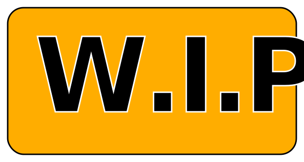
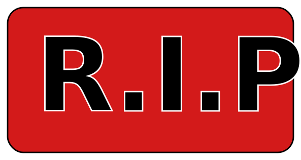
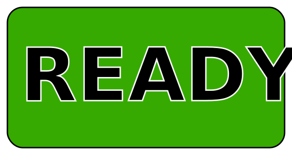

# Contributing

The Dungeon & Daemons project is an open source effort and welcome all kinds of contributions and feedback.

## Help us to improve & join our community by:

- Report an error (typos, grammer) or fix it on a pull-request.
- Give feedback.
- Ask questions

## Contribute with content:

- Propose ideas or suggest improvements. If it qualifies, we'll promote it to an issue.
- Create a pull request for concrete fixes or translations for games that is ready to be played (e.g grammer/typos/fix). Changes need to be approved by the core team.
- Create a pull request for games where help is needed (e.g any type of change). Any type of change is welcome.
- Create a pull request for games where work is in progress (e.g any type of change). All fixes are welcome, but feature requests or changes to the game rules, story arc, need to be discussed before being made.
- Create a pull request for games labeled "R.I.P" (e.g: any type of change). All changes are welcome, but it might get removed at a later stage unless you can considerably improve the quality of the game.  

## Where can I start?

- A good idea would be to go to https://dungeonsanddaemons.org/games when you click on a game, each game will be labeled: ready, w.i.p, r.i.p or help wanted. These labels tells you how you may proceede contributing to the game.

Some of the games that got created where storytelling/storybook games. These games were created using yaml and you may simply change the yaml under [characters](characters), [games](games), [rules](rules), [images](images). Keep in mind that when adding images to [images](images), you should also add images to [static/images](images/images). [images](images) is to be able to easily maintain and see how the game is like using yaml and [static/images](images/images) is to publish the images on the server. With time, we will make sure you only need to add images to [images](images). If you want to help with that, you are more then welcome.

"Help wanted!" Means that any contribution is more then welcome. The game is dependent on your contributions to get ready and playable by the comunity.

"W.I.P", means that this is work in progress, contributions are welcome, but the original creator might want you to make contributions according to the ideas of the game creator. It may be a good idea to ask a question in the github forum, create a github issue or discuss the finer point on slack with the game creator befor making any larger contributions.

"R.I.P", means the game is dead. We won't be maintaining it and it might get removed. You can just restart the development of the game, but you will have to get it up to a level where you can play it before we change the status back to "W.I.P" or "READY".

"Ready", means the game can be played and are in maintanence mode, bugfixes, changes and translations are still needed, but there won't be any large changes to the story or game rules. If you want to change the game, you should discuss it with the game creator before proposing your changes.
